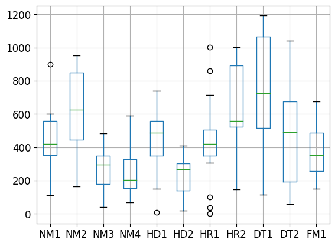
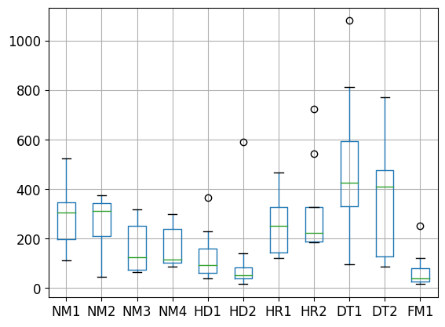

```python
import numpy as np # linear algebra
import pandas as pd # data processing, CSV file I/O (e.g. pd.read_csv)

# [OSU!] game server only tournament with 2 division. [90k] and [Open]
# bit.ly/NCT2

ninety = pd.read_csv("/kaggle/input/90k-qualifier/90k.csv")

# [90k]
# The value will just be expressed in terms of per 1000. (k) scores
ninety = ninety.iloc[:, 2:]/1000
ninety.describe().round(2)
```


<div>
<style scoped>
    .dataframe tbody tr th:only-of-type {
        vertical-align: middle;
    }

    .dataframe tbody tr th {
        vertical-align: top;
    }

    .dataframe thead th {
        text-align: right;
    }
</style>
<table border="1" class="dataframe">
  <thead>
    <tr style="text-align: right;">
      <th></th>
      <th>NM1</th>
      <th>NM2</th>
      <th>NM3</th>
      <th>NM4</th>
      <th>HD1</th>
      <th>HD2</th>
      <th>HR1</th>
      <th>HR2</th>
      <th>DT1</th>
      <th>DT2</th>
      <th>FM1</th>
    </tr>
  </thead>
  <tbody>
    <tr>
      <th>count</th>
      <td>17.00</td>
      <td>17.00</td>
      <td>17.00</td>
      <td>17.00</td>
      <td>17.00</td>
      <td>17.00</td>
      <td>17.00</td>
      <td>17.00</td>
      <td>17.00</td>
      <td>17.00</td>
      <td>17.00</td>
    </tr>
    <tr>
      <th>mean</th>
      <td>453.09</td>
      <td>617.49</td>
      <td>266.78</td>
      <td>263.20</td>
      <td>453.55</td>
      <td>215.09</td>
      <td>435.41</td>
      <td>635.22</td>
      <td>771.44</td>
      <td>458.68</td>
      <td>372.55</td>
    </tr>
    <tr>
      <th>std</th>
      <td>172.70</td>
      <td>258.46</td>
      <td>130.41</td>
      <td>144.96</td>
      <td>186.16</td>
      <td>128.86</td>
      <td>261.49</td>
      <td>275.02</td>
      <td>332.27</td>
      <td>279.39</td>
      <td>152.64</td>
    </tr>
    <tr>
      <th>min</th>
      <td>110.40</td>
      <td>163.88</td>
      <td>40.96</td>
      <td>68.32</td>
      <td>7.20</td>
      <td>18.02</td>
      <td>0.06</td>
      <td>148.57</td>
      <td>113.83</td>
      <td>59.02</td>
      <td>150.74</td>
    </tr>
    <tr>
      <th>25%</th>
      <td>353.97</td>
      <td>445.82</td>
      <td>177.68</td>
      <td>153.44</td>
      <td>349.25</td>
      <td>141.61</td>
      <td>348.45</td>
      <td>523.75</td>
      <td>516.98</td>
      <td>193.63</td>
      <td>257.98</td>
    </tr>
    <tr>
      <th>50%</th>
      <td>420.06</td>
      <td>625.41</td>
      <td>295.00</td>
      <td>205.05</td>
      <td>486.22</td>
      <td>267.19</td>
      <td>421.94</td>
      <td>557.78</td>
      <td>724.71</td>
      <td>491.58</td>
      <td>354.66</td>
    </tr>
    <tr>
      <th>75%</th>
      <td>558.14</td>
      <td>849.73</td>
      <td>351.03</td>
      <td>329.46</td>
      <td>557.57</td>
      <td>303.67</td>
      <td>504.82</td>
      <td>890.55</td>
      <td>1067.29</td>
      <td>674.27</td>
      <td>486.62</td>
    </tr>
    <tr>
      <th>max</th>
      <td>900.08</td>
      <td>953.80</td>
      <td>482.52</td>
      <td>589.84</td>
      <td>740.89</td>
      <td>410.74</td>
      <td>1003.33</td>
      <td>1002.42</td>
      <td>1192.22</td>
      <td>1040.17</td>
      <td>676.64</td>
    </tr>
  </tbody>
</table>
</div>


```python
ninety.boxplot(fontsize=12)
```


    <Axes: >


    

    


### [90k] Qualifier Mappool Summary
<style>
td,th {
  font-size: 30px
}
</style>

**<font color=#4045D2> NM3 </font>** **<font color=#4045D2> NM4 </font>** **<font color=#D2B440> HD2 </font>** **<font color=#71D240> FM1 </font>** relatively low avg (green 50% percentile, <400k) <br>
**<font color=#4045D2> NM2 </font>** **<font color=#D74B52> HR2 </font>** **<font color=#A54BD7> DT1 </font>** relatively good performance <br>
**<font color=#4045D2> NM2 </font>** **<font color=#D74B52> HR(s) </font>** **<font color=#A54BD7> DT(s) </font>** has spread distribution <br>
**<font color=#4045D2> NM1 </font>** only 1 fc but **<font color=#A54BD7> DT1 </font>** has multiple <br>


```python
op = pd.read_csv("/kaggle/input/open-qualifier/open.csv")

# [open]
# The value will just be expressed in terms of per 1000. (k) scores
op = op.iloc[:, 2:]/1000
op.describe().round(2)
```


<div>
<style scoped>
    .dataframe tbody tr th:only-of-type {
        vertical-align: middle;
    }

    .dataframe tbody tr th {
        vertical-align: top;
    }

    .dataframe thead th {
        text-align: right;
    }
</style>
<table border="1" class="dataframe">
  <thead>
    <tr style="text-align: right;">
      <th></th>
      <th>NM1</th>
      <th>NM2</th>
      <th>NM3</th>
      <th>NM4</th>
      <th>HD1</th>
      <th>HD2</th>
      <th>HR1</th>
      <th>HR2</th>
      <th>DT1</th>
      <th>DT2</th>
      <th>FM1</th>
    </tr>
  </thead>
  <tbody>
    <tr>
      <th>count</th>
      <td>8.00</td>
      <td>8.00</td>
      <td>8.00</td>
      <td>8.00</td>
      <td>8.00</td>
      <td>8.00</td>
      <td>8.00</td>
      <td>8.00</td>
      <td>8.00</td>
      <td>8.00</td>
      <td>8.00</td>
    </tr>
    <tr>
      <th>mean</th>
      <td>291.90</td>
      <td>263.69</td>
      <td>161.82</td>
      <td>167.27</td>
      <td>134.96</td>
      <td>123.53</td>
      <td>254.98</td>
      <td>316.05</td>
      <td>499.51</td>
      <td>361.91</td>
      <td>72.60</td>
    </tr>
    <tr>
      <th>std</th>
      <td>131.62</td>
      <td>118.09</td>
      <td>100.55</td>
      <td>90.69</td>
      <td>111.13</td>
      <td>193.14</td>
      <td>121.16</td>
      <td>203.02</td>
      <td>311.85</td>
      <td>238.74</td>
      <td>80.27</td>
    </tr>
    <tr>
      <th>min</th>
      <td>113.11</td>
      <td>44.43</td>
      <td>64.00</td>
      <td>86.27</td>
      <td>38.85</td>
      <td>15.55</td>
      <td>122.06</td>
      <td>184.69</td>
      <td>97.30</td>
      <td>87.92</td>
      <td>17.78</td>
    </tr>
    <tr>
      <th>25%</th>
      <td>198.16</td>
      <td>211.97</td>
      <td>74.48</td>
      <td>102.96</td>
      <td>62.93</td>
      <td>37.87</td>
      <td>143.25</td>
      <td>186.84</td>
      <td>331.71</td>
      <td>129.15</td>
      <td>25.33</td>
    </tr>
    <tr>
      <th>50%</th>
      <td>305.48</td>
      <td>313.00</td>
      <td>125.00</td>
      <td>115.44</td>
      <td>92.76</td>
      <td>51.70</td>
      <td>251.06</td>
      <td>224.24</td>
      <td>426.23</td>
      <td>410.77</td>
      <td>37.98</td>
    </tr>
    <tr>
      <th>75%</th>
      <td>347.82</td>
      <td>345.27</td>
      <td>252.64</td>
      <td>238.37</td>
      <td>159.82</td>
      <td>83.62</td>
      <td>326.76</td>
      <td>328.55</td>
      <td>595.28</td>
      <td>475.76</td>
      <td>80.38</td>
    </tr>
    <tr>
      <th>max</th>
      <td>523.62</td>
      <td>376.18</td>
      <td>317.68</td>
      <td>299.68</td>
      <td>365.53</td>
      <td>592.50</td>
      <td>468.39</td>
      <td>722.87</td>
      <td>1081.14</td>
      <td>770.88</td>
      <td>251.98</td>
    </tr>
  </tbody>
</table>
</div>


```python
op.boxplot(fontsize=12)
```


    <Axes: >


    

    


### [Open] Qualifier Mappool Summary
<style>
td,th {
  font-size: 30px
}
</style>

**<font color=#4045D2> NM1 </font>** **<font color=#4045D2> NM2 </font>** **<font color=#D74B52> HR(s) </font>** **<font color=#A54BD7> DT(s) </font>** has overall good preformance <br>
**<font color=#D2B440> HD2 </font>** **<font color=#71D240> FM1 </font>** pooler overcooked and only very few player able to "enjoy" the map because the reading difficult <br>
**<font color=#4045D2> NM3 </font>** **<font color=#4045D2> NM4 </font>** **<font color=#D2B440> HD1 </font>** are relatively challenging for player base <br>
Some brilliant scores from few players. But the pool difficulties not justified for the target SR/difficulty for server player base
